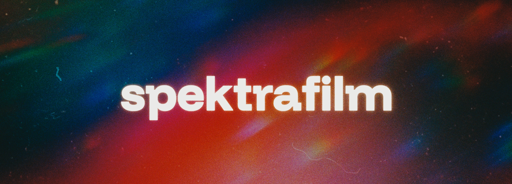

> [!WARNING]
>
> **I love building spektrafilm**, and I invested already hundreds of hours in it. Right now it’s a nights-and-weekends project. If it will help pay some bills, I can keep improving it for everyone. 🙂 Any **support** is really appreciated: [Buy me a coffee](https://buymeacoffee.com/andreavolpato)
> 
> **2026/05/28 big git history cleanup** (140MB -> 45MB) --> please reclone!
> 

# Spectral film simulations of analog photography

An exploration of how to make good use of spectroscopic data from manufacturer datasheets in an end-to-end, physically based model with spectral calculations, with the goal of turning that data into convincing film, print, and scan renderings that can be explored interactively.

Here are some useful links and spin-off projects:
- Discussion about the project is happeing at [discuss.pixls.us](https://discuss.pixls.us/c/software/spektrafilm/).
- Join us at the official [subreddit](https://www.reddit.com/r/spektrafilm/).
- A [high-level writeup](https://discuss.pixls.us/t/spectral-film-simulations-from-scratch/) is available as a gentle entrypoint to the spectral framework.
- Vote [your next stock](https://discuss.pixls.us/t/2026-q2-data-sheets-digitization-campaign/58032) you would like to see in spektrafilm.
- A blazing fast Vulkan implementation is available in [vkdt](https://jo.dreggn.org/vkdt/src/pipe/modules/filmsim/readme.html) by [hanatos](https://github.com/hanatos).
- An [OFX plugin](https://spektrafilm.114c.de/) was developed by [Aedan](https://github.com/chaert-s).
- A fast [rust implementaion](https://github.com/turbasvin/spektrafilm-rs) is being developed by [turbasvin](https://github.com/turbasvin).
- A LUT-based bridge is available in [ART](https://artraweditor.github.io/SpectralFilmSimHowto) by [agriggio](https://github.com/agriggio).


In practice, this Python repository is **the reference implementation** for other developments, and the place where I am growing the underlying model. It lets you start from a camera image, pass it through a virtual negative, print, and scan pipeline, and inspect how film-stock data, couplers, enlarger settings, grain, halation, and other photographic effects shape the final result. The aim is not just to imitate a generic "film look," but to build a model that is grounded in measurements and predicts real-world behaviors of photographic materials.


The desktop GUI exposes the Python tech-demo functionality without writing code,
letting you import RAW files or prepared linear images, explore different film
and paper profiles, adjust the simulation interactively, and move quickly
between fast(-ish) previews and more detailed final scans. Full resolution
export is very slow at the moment.

> [!IMPORTANT]
>   spektrafilm (all lower caps) is open for research, integration, and production use. The project is in rapid development, some ares are still being build and will change fast.
>
> If you find it useful:
>  * Acknowledge spektrafilm in plugin descriptions, marketing, or credits (e.g.
>    "film modeling powered by `spektrafilm`" or "film modeling inspired by
>    `spektrafilm`", see `CITATION.cff`).
>  * Consider starring the repo or sharing your results.
>  * Cite the repo/Zenodo DOI in academic work (see `CITATION.cff`).
>  * Consider [buying me a coffee](https://www.buymeacoffee.com/andreavolpato) to fuel the next all-nighter coding session :)
>
>  *The project is GPLv3 licensed*, so any derivative work must also be open source under the same license. Derivatve work includes any software, plugin, or tool that incorporates spektrafilm code or is directly inspired by its methods.
>
> *JSON profiles and LUTs are CC BY-SA 4.0.*
>  
>  If *GPLv3 is not compatible with your project*, please reach out to discuss
>  alternative options. I am very open to collaboration and integration, but I
>  want to ensure that spektrafilm remains open source and for the community. 
>
> LUTs are on a strict "*commercial use, free share, no resale*" custom [license](SPEKTRAFILM_LICENSE.txt).
>
>  This helps sustain open color science. Thanks!


## Introduction

The simulation emulates negative or positive film emulsions starting from
published data for film stocks. An example of the curves for Kodak Portra 400
(data-sheet e4050, 2016) is shown in the following figure (note that the CMY
diffuse densities are generic because they are usually not published).


An example of data for Kodak Portra Endura print paper (data-sheet e4021, 2009)
is shown in the next figure.


The left panel shows the spectral log sensitivities of each color layer. The
central panel shows the log-exposure-density characteristic curves for each
layer when the medium is exposed to a neutral gray gradient under a reference
light. The panel on the right shows the absorption spectra of the dyes formed on
the medium during chemical development. 'Min' and 'Mid' are the absorption
values for the unexposed processed medium and a neutral gray "middle" exposure,
respectively.

Starting from linear RGB data from a camera RAW file, the simulation
reconstructs the spectral data, projects the virtual light transmitted through
the negative onto print paper, and uses a simplified color enlarger with
dichroic filters to balance the print. Finally, it scans the virtual print using
the light reflected from the print.

The pipeline is sketched in this figure, adapted from [^1]:  Here,
light from a scene (a RAW file from your camera) is exposed onto a virtual
negative with specific spectral sensitivities, then a chemical process creates
the dye densities using density curves and more complex interactions that model
the couplers. The virtual negative is projected with a specific illuminant onto
paper that is developed again with simple density curves and no couplers in this
case. Print paper is already designed to reduce channel cross-talk, since it
does not need to sample a scene, only the dyes on the negative.

The pipeline allows many characteristics to be added in a physically sound way.
For example:

- halation
- film grain generated on the negative (using a stochastic model)
- pre-flashing of the print to retain highlights

From my experience experimenting with film simulation, data-sheet curves are
really not enough to reproduce a decent film look. The key is to understand that
film emulsions contain couplers, chemicals that are produced during development
alongside the actual CMY dyes, and these are very important for achieving the
desired saturation. The main ones are:

- masking couplers, which give the typical orange color to unexposed developed
film. These couplers are consumed locally where density is formed and are used
to reduce the effect of cross-talk in layer absorption, thus increasing
saturation. The presence of masking couplers is simulated with a negative
absorption contribution in the isolated dye absorption spectra. See, for
example, data for Portra 400 updated to include the masking couplers and with
unmixed print density characteristic curves: 

- direct inhibitor couplers, which are released locally when density is formed
  and inhibit the formation of density in nearby layers or in the same layer.
  This increases saturation and contrast. Also, if we let the couplers diffuse
  in space, they can increase local contrast and perceived sharpness.

A more detailed description of colour couplers can be found in Chapter 15 of
Hunt's book [^2].

## Package layout

The codebase is organized as three packages under `src/`:

1. [src/spektrafilm](src/spektrafilm): runtime simulation pipeline (the
   physical-pipeline core). Linear-in / linear-out, no GUI or LUT concerns.
2. [src/spektrafilm_gui](src/spektrafilm_gui): desktop Qt + napari GUI built on
   top of the runtime.
3. [src/spektrafilm_lut_creator](src/spektrafilm_lut_creator): LUT bake + QA +
   OCIO config emission. Builds `.cube` / `.3dl` / Hald-CLUT PNG bundles in
   1-LUT / 2-LUT / 3-LUT / 4-LUT topologies with optional standalone OCIO 2
   configs for pipeline integration. Drives via the `spektrafilm-lut`
   command-line tool or the Python `BundleBuilder` API.

Canonical import surfaces:

1. Runtime API:
   [src/spektrafilm/runtime/api.py](src/spektrafilm/runtime/api.py).
2. GUI entry point: [src/spektrafilm_gui/app.py](src/spektrafilm_gui/app.py).
3. LUT bundle builder:
   [src/spektrafilm_lut_creator/builders.py](src/spektrafilm_lut_creator/builders.py).

Minimal runtime API:

```python
from spektrafilm import create_params, simulate

params = create_params(
	film_profile="kodak_portra_400",
	print_profile="kodak_portra_endura",
)
result = simulate(image, params)
```

Minimal LUT-bake API:

```python
from spektrafilm_lut_creator.builders import BundleBuilder
from spektrafilm_lut_creator.bundles import BundleSpec

spec = BundleSpec(
      film_profile="kodak_portra_400",
      print_profiles=("kodak_portra_endura",),
      input_color_space="Panasonic V-Log",
      output_color_space="sRGB",
      topology="1lut",
      resolution=33,
      ocio_config=True,   # opt-in: also emit a standalone OCIO 2 config
      qa=True,            # opt-in: run the QA suite and emit report.html
      target="lumix_reatlime_vlog",  # special .cube files for lumix realtime 
)
builder = BundleBuilder(spec)
builder.write(builder.build())   # lands in build/lut_bundles/<auto-name>/
```

Equivalent on the command line — color spaces accept canonical
registry names or `short_tag` slugs (`vlog`, `srgb`, `acescg`, ...):

```bash
spektrafilm-lut build \
	--film kodak_portra_400 \
	--print kodak_portra_endura \
	--input vlog --output srgb \
	--topology 1lut \
   --resolution 33 \
	--qa \
   --ocio-config \
	--out ./build/lut_bundles/

spektrafilm-lut list film         # discover registered profiles
spektrafilm-lut list print        # discover registered profiles
spektrafilm-lut list input        # discover input color spaces
spektrafilm-lut list output       # discover output color spaces
spektrafilm-lut list target       # discover supported target (eg lumix realtime)
```

For complex specs (nested gamut-compression settings, multi-paper
bundles), pass `--from spec.toml` to load the full `BundleSpec` from
a TOML file.

Dependency direction:

1. `spektrafilm_gui` depends on `spektrafilm`.
2. `spektrafilm_lut_creator` depends on `spektrafilm`.
3. `spektrafilm` (runtime) does not depend on any of the higher-level packages.

## Installation

> [!NOTE] 
> Since spektrafilm is not compatible with the latest Python version, an
> older version like 3.13 must be used.

I reccomend to install spektrafilm with `conda`+`pip` for now, just because it 
is my current workflow and thus it has more chances to be tested right after 
commit.

### Using `uv`

You can easily run the latest version of spektrafilm directly from the Git
repository using [uv](https://docs.astral.sh/uv/). The default install now
includes the desktop GUI and LUT-creator dependencies; only development tools
remain optional:

```bash
uvx --python 3.13 --from git+https://github.com/andreavolpato/spektrafilm.git spektrafilm
```

Or from a local working copy:
```bash
uvx --python 3.13 --from /path/to/local/working_copy spektrafilm
```

Alternatively, you can install spektrafilm permanently which will provide you
the `spektrafilm` command:

```bash
uv tool install --python 3.13 git+https://github.com/andreavolpato/spektrafilm.git
```

For full development, install the project with `[dev]` to add the test tooling
on top of the default install.

#### Installing uv

Under Windows you can install `uv` using the following command, which you only
need to execute once:
```bash
# ! you only need to exeucte this command the first time to install uv!
powershell -ExecutionPolicy ByPass -c "irm https://astral.sh/uv/install.ps1 | iex"
```
Instructions for macOS and Linux are
[here](https://docs.astral.sh/uv/getting-started/installation/#standalone-installer).


### Using `pip`

You can also use `pip` normally. The default install already includes the GUI
and LUT-creator dependencies; `dev` is the only remaining optional extra.

```bash
# install the default package (desktop app + LUT creator included):
git clone https://github.com/andreavolpato/spektrafilm.git
cd spektrafilm
pip install -e .

# run
spektrafilm
```
I recommend creating a clean virtual environment to install the dependencies,
for example by using `conda`.

#### Using `conda`
From a terminal:

```bash
conda create -n spektrafilm python=3.13
conda activate spektrafilm
```

Install the package `spektrafilm` by going to the repository
folder and running:

```bash
pip install -e .
```
Launch the GUI by activating the environment and:

```bash
spektrafilm
```
To remove the environment:
```bash
conda env remove -n spektrafilm
```

### Install options

| Install command | What you get |
|---|---|
| `pip install -e .` | Default install: core runtime + GUI + LUT creator. Provides both the `spektrafilm` and `spektrafilm-lut` commands. |
| `pip install -e ".[dev]"` | Default install + test tooling (`pytest`, OCIO config validation). |

The same `[extras]` syntax works with `uv pip install` and `uv tool install`.
For one-off runs with `uvx`, use `--from` as shown above.

> [!NOTE]
> On Windows PowerShell and on macOS zsh, quote the brackets to prevent
> shell glob expansion: `pip install -e ".[dev]"`.

## Testing

Install the default package plus the dev tooling, then run the test suite:

```bash
pip install -e ".[dev]"
python -m pytest tests -v
```

Regression snapshots are stored as committed `.npz` files in `tests/baselines/`
and are checked by `tests/test_regression_baselines.py`. When a simulation
change is intentional, regenerate snapshots manually:

```bash
python scripts/regenerate_test_baselines.py
```

Snapshot files are never updated automatically during pytest runs.

## GUI
When launching the GUI, a `napari` window should appear. Note that `napari` is
not color-managed. The way I work is to set the screen and operating system
color profile to sRGB, and I set the output color space of the simulation to
sRGB. On Windows, the GUI will try to get the display profile and convert the
final image for viewing; if successful, this will be indicated in the status
bar.

You can import camera RAW files directly from the `import raw` section. Choose
the white balance mode (`as shot`, `daylight`, `tungsten`, or `custom`), set
temperature and tint when using `custom`, then click `select file`. The RAW
importer uses `rawpy` and converts the image to the current `input color space`
and `apply CCTF decoding` settings. You can use `reprocess raw` to reload the
same file and reprocess it with the new settings.

> [!TIP] 
> Hover over the widgets and controls to see a helpful tooltip.

You can still load externally prepared linear images through the `file loader`.
This is useful if you want a fully manual raw-development workflow or if you
prefer preprocessing in another tool. For best results, keep the image
scene-referred and linear, ideally as a 16-bit or 32-bit float TIFF/EXR in a
wide-gamut color space such as linear Rec2020 or linear ProPhoto RGB.

> [!IMPORTANT] 
> The `file loader` imports 16-bit and 32-bit image files as new
> layers using OpenImageIo. PNG, TIFF, and EXR are known to work, and other
> formats may work too.

Please bear in mind that this is a highly experimental project, and many
controls are exposed in the GUI with little or no documentation. Use the
tooltips by hovering over the controls, or explore the code. Adjust
`exposure_compensation_ev` to change the exposure of the negative. You can
visualize a virtual scan of the negative by pressing `scan_film` and
`PREVIEW/SCAN`.

For fine-tuning halation, adjust `scattering size`, `scattering strength`,
`halation size`, and `halation strength`. There are three controls for each,
defining the effect on the three color channels (RGB). `scattering size` and
`halation size` represent the sigma value for Gaussian blurring. `scattering
strength` and `halation strength` refer to the percentage of scattered or
halated light. `y filter shift` and `m filter shift` are the controls for the
virtual yellow and magenta filters of the color enlarger. They are the number of
steps shifted from a neutral position, that is, the starting settings that make
an 18% gray target photographed with the correct reference illuminant fully
neutral in the final print.

There are controls to apply lens blur at several stages of the pipeline, for
example in the camera lens, the color enlarger lens, or the scanner. There is
also a control for blurring density to simulate diffusion during development,
`grain > blur`. The scanner also has sharpness controls via a simple unsharp
mask filter.

For example, upscaling a small crop of the film 12 times reveals the dye clouds.


This is one of the most appealing aspects for me, especially when I think of
printing large, high-resolution simulated images while retaining all this
low-level grain detail that is not present in the original picture.

## Preparing input images manually with darktable

Direct RAW import in the GUI is the simplest workflow, but manual development is
still useful when you want tighter control over the input rendering.

The simulation expects linear scene-referred files as input, with or without a
transfer function. I usually open RAW files from digital cameras with
[darktable](https://www.darktable.org/), deactivate the non-linear mappings done
by `filmic` or `sigmoid`, and adjust the exposure to preserve all the
information while avoiding clipping. Then I export the file as a 32-bit float
TIFF in linear ProPhoto RGB.

## Example usage of the GUI

[Watch the GUI demo
video](https://github.com/user-attachments/assets/534746b5-87ec-4bd0-96c9-5214ef7e381b)

## Things to consider

- The simulation is quite slow for full-resolution images. On my laptop it takes
  roughly 10 seconds to process 6 MP images. I usually adjust most values with
  `PREVIEW`. When a final image is needed, use `SCAN`, which bypasses image
  scaling.
- Based on my experience building the profiles, Fujifilm data are less
  self-consistent than Kodak data.

## Support

spektrafilm is developed in my free time, often during late nights after my research work at KTH. If you'd like to support continued development and help fuel the next all-nighter coding session, consider [buying me a coffee](https://buymeacoffee.com/andreavolpato). Your contributions help me dedicate more time to the project and giving back to the [pixls.us](https://discuss.pixls.us/) community.

## References

[^1]: Giorgianni, Madden, Digital Color Management, 2nd edition, 2008 Wiley
[^2]: Hung, The Reproduction of Color, 6th edition, 2004 Wiley
[^3]: Mallett, Yuksel, Spectral Primary Decomposition for Rendering with sRGB
    Reflectance, Eurographics Symposium on Rendering - DL-only and Industry
    Track, 2019, doi:10.2312/SR.20191216

Sample images are from
[signatureedits.com](https://www.signatureedits.com/)/free-raw-photos.


